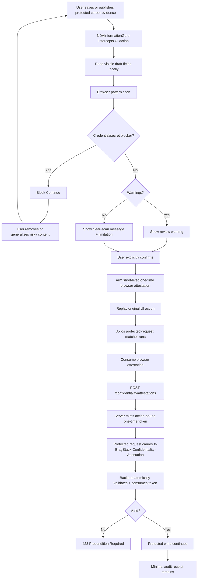

# BragStack NDA & Confidentiality Safety Workflow

**Internal engineering document**

Status: end-to-end confidentiality gate, API attestation enforcement, and minimal audit receipts implemented on `feature/nda-confidentiality-gate` / PR #306.

## Purpose

BragStack helps users capture career evidence without encouraging them to copy confidential employer, client, patient, student, customer, constituent, or other restricted information into the product.

The NDA/confidentiality system is a defense-in-depth safety control. It does **not** interpret contracts, decide whether disclosure is legally permitted, classify every possible secret, or certify that a record is “NDA compliant.”

Core principle:

> Capture the career signal, not the secret.

## Protected write classes

The server recognizes these protected action classes:

| HTTP request | Action class |
| --- | --- |
| `POST /entries` | `entry.create` |
| `PUT` or `PATCH /entries/{id}` | `entry.update` |
| `POST /impact-receipts` | `impact_receipt.create` |
| `POST /impact-receipts/from-entry/{id}` | `impact_receipt.create_from_entry` |
| `PATCH /impact-receipts/{id}` | `impact_receipt.update` |

Reads and deletes are not confidentiality-attestation protected. Authentication, billing, packets, profile changes, and unrelated API writes are not matched by this control.

The normal UI gate currently intercepts protected Accomplishment and Impact Receipt forms plus recognized publication/edit controls on `/app/accomplishments` and `/app/impact-receipts`.

## End-to-end workflow



## 1. Global browser gate

`frontend/src/main.jsx` mounts `NDAInformationGate` once at the application root.

Primary files:

- `frontend/src/NDAInformationGate.jsx`
- `frontend/src/NDAInformationGate.css`
- `frontend/src/ndaSafety.js`

The gate uses capture-phase `submit` and `click` listeners. For a protected action it prevents the original event, scans the associated form/card, opens the confidentiality dialog, and stores a callback that can replay the original action after confirmation.

Replay bypass refs prevent the replayed event from reopening the same dialog in a loop.

## 2. Local browser scan

`scanSubmissionContainer()` gathers non-empty text values from protected `input` and `textarea` elements and runs the deterministic scanner in `ndaSafety.js`.

The scan itself is local. It does not intentionally transmit the draft merely to perform pattern matching.

### Blocking patterns

Configured blockers include:

- private-key headers;
- bearer/authentication tokens;
- password/API-key/access-token/client-secret assignments;
- common provider credential formats; and
- JWT-like access tokens.

A blocker disables Continue even if the confirmation checkbox is checked. The UI reports the finding category and does not echo the detected secret value.

### Warning patterns

Configured review warnings include:

- fenced code blocks;
- stack traces and diagnostic/log output;
- localhost, RFC1918/private network addresses, `.internal`, `.corp`, and `.local` hosts;
- ticket/work-item style identifiers; and
- restricted-reference wording such as private repositories, production logs, customer data, and credentials.

Warnings are intentionally conservative. They do not prove that content is confidential.

### Clean scans

“No obvious pattern detected” is never represented as approval. Pattern matching can produce both false positives and false negatives.

## 3. Explicit user confirmation

When no blocking finding remains, the user must confirm that the material they are about to store or publish does not contain confidential, proprietary, restricted, or other information they are prohibited from storing or disclosing.

The dialog links to `/nda-safety` and explicitly says BragStack does not interpret the user’s agreement.

## 4. One-time browser attestation

After confirmation, `armConfidentialityAttestation()` stores a short-lived one-time attestation in browser memory. It is not persisted to local storage.

`consumeConfidentialityAttestation()` clears the browser value when a protected request attempts to use it. The current browser TTL is 15 seconds.

`isConfidentialityProtectedRequest()` uses the same protected request classes as the backend.

## 5. Request-layer handshake

`frontend/src/api.js` contains an asynchronous Axios request interceptor.

For a protected write:

1. attach the normal bearer authentication token;
2. consume the one-time browser confidentiality attestation;
3. if present, mint a server token with `POST /confidentiality/attestations`;
4. send only control metadata to the mint endpoint: version, HTTP method, path, and `confirmed: true`;
5. attach the returned token to `X-BragStack-Confidentiality-Attestation`; and
6. continue the original protected write.

The mint request uses bare `axios.post`, not the configured protected API instance, so it does not recursively trigger the protected-write interceptor.

If no browser attestation is armed, the interceptor does **not** fabricate a server token. The protected request reaches the backend without the special header and is rejected with `428`.

## 6. Server attestation issuance

Primary files:

- `backend/app/confidentiality.py`
- `backend/app/confidentiality_routes.py`

`POST /confidentiality/attestations` requires:

- an authenticated user;
- the current attestation version;
- a supported protected method/path; and
- `confirmed: true`.

The server generates a cryptographically random token. Only the SHA-256 hash is stored. The plaintext token is returned once to the client.

Current server token TTL: 120 seconds.

Tokens are bound to:

- user ID;
- action class;
- attestation version; and
- unconsumed/unexpired status.

## 7. Atomic server enforcement

`enforce_confidentiality_attestation()` is attached as a FastAPI dependency to the Accomplishment and Impact Receipt routers in `backend/app/main.py`.

The backend performs an atomic `find_one_and_update` matching the user, action, version, token hash, issued status, and unexpired timestamp.

Successful consumption changes the receipt to `consumed` and records `consumed_at` plus the request ID.

Missing, expired, reused, wrong-user, wrong-action, or otherwise invalid tokens return `428 Precondition Required`.

Because the token is consumed atomically, one token cannot be replayed for multiple protected writes.

## 8. Minimal audit receipts

Mongo collection:

- `confidentiality_attestations`

Stored control metadata includes:

- user ID;
- action class;
- attestation version;
- token **hash**;
- issued/consumed status;
- issued, expiry, consumed, and purge timestamps; and
- request ID after successful consumption.

The confidentiality receipt intentionally does **not** store the career draft, NDA text, uploaded evidence, or plaintext attestation token.

Audit metadata has a retention TTL (`purge_at`) currently set to 90 days.

Internal read endpoint:

- `GET /ops/confidentiality/attestations`

It is restricted to authorized `ops`, `security`, or `admin` roles and serializes only safe control metadata. Token hashes and draft content are not returned.

## 9. Relationship to `/ops/compliance`

The general compliance/business-readiness audit and confidentiality attestation receipts are separate controls with separate data stores.

Do not copy confidential drafts into compliance receipts. The compliance system may eventually report whether the NDA/confidentiality control is configured and healthy, but it should reference control status rather than duplicate user career evidence.

## 10. NDA-safe sanitization helpers

`frontend/src/ndaSafety.js` includes:

- `sanitizeNdaText()`;
- `makeAccomplishmentNdaSafe()`; and
- `makeImpactReceiptNdaSafe()`.

They can remove obvious credentials, omit fenced code, generalize ticket identifiers, remove private/internal references and diagnostics, reset sharing to private, clear exact Impact Receipt metrics, and preserve only explicitly public references that do not look internal.

`frontend/src/NDASafetyPanel.jsx` is the reusable UI component for these helpers.

### Current UI boundary

The global confidentiality gate and end-to-end attestation enforcement are active. `NDASafetyPanel.jsx` is still a reusable component rather than an automatically mounted panel inside every protected editor. Do not describe the production workflow as automatically rewriting every draft.

The sanitizer is a risk-reduction helper, not a legal verdict. Users must review rewritten output.

## 11. Public-source ceiling

The rule remains:

> The public source is the ceiling.

A public repository change, award, release note, campaign, documentation page, report, portfolio item, or other authorized source supports only what that source itself demonstrates. It does not authorize adding private context known from internal work.

## 12. CORS and request IDs

`backend/app/main.py` allows `X-BragStack-Confidentiality-Attestation` through CORS.

Request middleware assigns `request.state.request_id` before route dependencies run so successful attestation consumption can be correlated to a sanitized operational request record without copying the protected content into the attestation audit.

## 13. Tests

Frontend safety suites:

- `frontend/src/ndaSafety.test.js`
- `frontend/src/ndaInformationGateSource.test.js`
- `frontend/src/ndaGuidanceSource.test.js`
- `frontend/src/ndaApiSource.test.js`

Backend coverage:

- `backend/tests/test_confidentiality_attestation.py`
- `backend/tests/test_core_indexes.py`
- `backend/tests/test_impact_receipt_core_loop.py`
- `backend/tests/test_impact_receipt_visibility.py`

Coverage includes scanner blockers/warnings, false-positive safe wording, sanitizer transformations, one-time browser use, protected-request matching, client/server handshake wiring, stale versions, unsupported actions, missing tokens, expiry, wrong user, wrong action, token replay, safe audit serialization, index shape, and real protected Impact Receipt writes.

Frontend safety command:

```bash
cd frontend
npm run test:safety
```

Backend command:

```bash
cd backend
python -m pytest
```

Both are part of PR CI.

## 14. Engineering change checklist

When changing this system:

1. Keep frontend and backend protected-action matching in sync.
2. Never log or echo detected secret values.
3. Never put the career draft or NDA text into the attestation receipt.
4. Keep the mint endpoint outside the protected-write matcher to avoid recursion.
5. Preserve one-time, action-bound, user-bound token semantics.
6. Add positive, negative, replay, expiry, and false-positive tests for new rules.
7. Re-run the safety suite, full backend suite, lint, build, and dependency audit.
8. Update `/nda-safety` when user-visible behavior changes.
9. Update this document whenever an enforcement boundary changes.
10. Do not claim BragStack verifies legal NDA compliance.

## 15. Known limitations

The system cannot know every employer-specific project name, trade secret, protected metric, professional confidentiality rule, or contract restriction. It cannot determine whether a disclosure is legally authorized.

A user with direct API access can request an attestation endpoint token after asserting `confirmed: true`; the server cannot independently prove that the human read the UI. The value of server enforcement is that protected API writes require an explicit, short-lived, auditable control step rather than silently bypassing the product’s safety workflow.

The pattern scanner is a safety net, not a substitute for user judgment, employer/client policy, professional obligations, or legal review.
