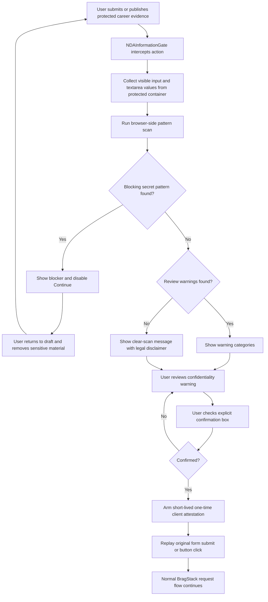

# BragStack NDA & Confidentiality Safety Workflow

**Internal engineering document**

Status: implemented on `feature/nda-confidentiality-gate` / PR #306

## Purpose

BragStack is designed to help users capture career evidence without encouraging them to copy confidential employer or client material into the product. The NDA safety system is a defense-in-depth UX control. It does **not** interpret contracts, decide what an employer permits, or certify that a record is legally safe to store or publish.

The core principle is:

> Capture the career signal, not the secret.

## Current protected surfaces

The global NDA gate currently protects these user actions:

- Creating or editing an Accomplishment through the protected Accomplishments form.
- Creating an Impact Receipt through the protected create form.
- Saving an Impact Receipt edit when the protected action is recognized.
- Changing protected Accomplishment or Impact Receipt visibility through the recognized public/private controls.

Reads and ordinary navigation are not gated. Delete operations are not currently gated.

## High-level workflow



## Step-by-step behavior

### 1. Global gate is mounted once

`frontend/src/main.jsx` mounts `NDAInformationGate` at the application root. The gate listens globally for protected form submissions and protected button clicks.

Primary component:

- `frontend/src/NDAInformationGate.jsx`

### 2. Protected action is intercepted before the original action completes

The gate uses capture-phase document listeners for `submit` and `click` events. If the current route and element match a protected action, the gate:

1. calls `preventDefault()`;
2. stops propagation;
3. stores a callback representing the original action;
4. scans the relevant form/card container; and
5. opens the NDA confirmation dialog.

The original action is replayed only after the safety flow permits it.

### 3. Draft text is scanned locally in the browser

`scanSubmissionContainer()` reads non-empty text values from `input` and `textarea` elements in the relevant protected container and passes them to `scanSensitiveText()`.

The local scanner is in:

- `frontend/src/ndaSafety.js`

The scan is pattern-based and does not intentionally send the draft elsewhere merely to perform the scan.

### 4. Findings are classified by severity

#### Blocking findings

Blocking patterns currently include categories such as:

- private-key material;
- bearer/authentication tokens;
- password, API-key, access-token, or client-secret assignments;
- common provider token formats; and
- JWT-like signed access tokens.

If a blocker is found:

- the user sees a blocking warning;
- the confirmation button remains disabled even if the checkbox is checked; and
- the action must not continue until the risky material is removed.

The UI reports the category rather than echoing the submitted secret value.

#### Warning findings

Warning patterns currently include categories such as:

- fenced code blocks;
- stack traces and diagnostic/log output;
- localhost, RFC1918/private network, `.internal`, `.corp`, and `.local` hosts;
- ticket/work-item style identifiers; and
- restricted-reference wording such as private repositories, internal tickets, production logs, customer data, and credentials.

Warnings do not automatically prove the text is confidential. They force review and encourage the user to generalize the material before continuing.

### 5. A clean scan is not represented as approval

When no obvious high-risk pattern is detected, the dialog explicitly states that this is **not a legal determination**. Pattern matching can produce both false positives and false negatives.

A clean scan means only that the current scanner did not recognize one of its configured patterns.

### 6. User must explicitly attest before continuing

The user must check a confirmation stating that the information they are about to submit or publish does not contain confidential, proprietary, restricted, or other material they are prohibited from storing or disclosing.

The gate also links to the public `/nda-safety` guidance and reminds the user that BragStack does not interpret the agreement.

### 7. The original action is replayed after confirmation

When the user confirms and there are no blocking findings, the gate:

1. closes the dialog;
2. arms a short-lived one-time client-side confidentiality attestation; and
3. replays the original form submission or click.

Bypass refs in `NDAInformationGate.jsx` prevent the replayed action from immediately reopening the same gate in a loop.

## The client attestation

`ndaSafety.js` currently exposes:

- `armConfidentialityAttestation()`;
- `consumeConfidentialityAttestation()`; and
- `isConfidentialityProtectedRequest()`.

The attestation is short-lived and one-time in browser memory.

### Important current implementation boundary

At the time of this document, the UI gate **arms** the one-time attestation, but the PR does not yet wire a network/request interceptor or backend endpoint to **consume and validate** that attestation on the server.

Therefore, the currently enforced control is primarily a **client-side UX gate**. It meaningfully reduces accidental disclosure in the normal UI path, but it is not a server-side authorization boundary and should not be described internally or externally as impossible to bypass.

Recommended defense-in-depth follow-up:

1. add a client request interceptor for protected writes;
2. attach an attestation version/header only when `consumeConfidentialityAttestation()` succeeds;
3. validate the attestation requirement server-side for protected write routes;
4. log a minimal non-sensitive audit receipt containing route class, attestation version, timestamp, and outcome; and
5. never log the submitted confidential draft merely for the attestation audit.

## NDA-safe sanitization library

`ndaSafety.js` also contains sanitization helpers:

- `sanitizeNdaText()`;
- `makeAccomplishmentNdaSafe()`; and
- `makeImpactReceiptNdaSafe()`.

These functions can:

- remove obvious credentials;
- omit fenced code blocks;
- generalize ticket-style identifiers;
- remove internal/private references;
- remove diagnostic lines;
- reset sharing to private;
- clear exact Impact Receipt metric values; and
- preserve only explicitly user-marked public evidence URLs that do not look internal.

### Current UI integration boundary

`NDASafetyPanel.jsx` provides UI for the sanitization helper, but in the current PR it is not yet mounted into the Accomplishments or Impact Receipts page implementations. Treat the sanitizer and panel as available building blocks until page-level integration is completed.

Do not describe the current production workflow as automatically rewriting every protected draft unless that integration has been added and verified.

## Public-source ceiling

If an evidence link is already public, BragStack may preserve that reference when the user explicitly marks it as public and it does not look internal.

The rule remains:

> The public source is the ceiling.

A public merge request, release note, documentation page, or repository change may support only what that public source itself demonstrates. It does not authorize adding private customer names, architecture details, unpublished metrics, incidents, deployment details, or other nonpublic context.

## What the system does not do

The NDA safety system does not currently:

- parse or interpret the user's actual NDA;
- know every employer-specific confidential project name;
- know whether a metric was approved for public disclosure;
- determine trade-secret status;
- determine invention-assignment obligations;
- guarantee detection of all secrets;
- guarantee that a warning is truly confidential;
- make prohibited third-party storage permissible because the record is marked private; or
- provide legal advice.

## Control matrix

| Control | Current status | Enforcement point |
| --- | --- | --- |
| Protected UI submit interception | Implemented | Browser UI |
| Protected visibility-action interception | Implemented | Browser UI |
| Local credential/secret scan | Implemented | Browser UI |
| Warning scan for code/log/internal references | Implemented | Browser UI |
| Explicit user confirmation | Implemented | Browser UI |
| Blocking on detected credential patterns | Implemented | Browser UI |
| Public NDA guidance | Implemented | `/nda-safety` |
| One-time attestation object | Implemented | Browser memory |
| Request-layer attestation consumption | Not yet wired | Future client integration |
| Server-side attestation validation | Not yet implemented | Future backend integration |
| NDA-safe sanitizer library | Implemented | Frontend library |
| NDA-safe sanitizer panel | Implemented component | Not yet mounted in protected pages |
| Minimal audit receipt for NDA confirmation | Not yet implemented | Future backend/ops work |

## Tests

Primary deterministic tests:

- `frontend/src/ndaSafety.test.js`
- `frontend/src/ndaInformationGateSource.test.js`
- `frontend/src/ndaGuidanceSource.test.js`

Coverage includes:

- credential and token pattern detection;
- private/internal host detection;
- ticket IDs;
- code and diagnostic patterns;
- expected safe wording;
- sanitizer transformations;
- exact metric handling;
- evidence public/private handling;
- public-source ceiling behavior;
- one-time attestation behavior;
- protected request matching;
- gate source behavior; and
- required public documentation language.

Run locally with:

```bash
cd frontend
npm run test:safety
```

The PR workflow also runs the NDA safety suite as part of the deterministic frontend checks.

## Engineering change checklist

When changing NDA safety behavior:

1. Identify every protected user action affected by the change.
2. Confirm the gate intercepts both initial storage and later publication actions where applicable.
3. Keep scanning local unless there is an explicit, reviewed reason to send draft content elsewhere.
4. Never echo detected secret values in warnings, logs, analytics, or audit events.
5. Add positive, negative, and regression tests for new scanner patterns.
6. Add false-positive tests for ordinary career language.
7. Update public guidance when user-visible behavior changes.
8. Update this internal document when enforcement boundaries change.
9. Do not describe a client-side control as a server-side security boundary.
10. Require security/legal review before claiming that BragStack verifies NDA compliance.

## Recommended next hardening phase

The highest-value next step is to convert the current UI-only confirmation into a defense-in-depth write-control:

**Gate -> local scan -> confirmation -> one-time attestation -> request interceptor -> backend validation -> minimal audit receipt.**

That would preserve the current user-friendly workflow while making protected API writes much harder to bypass accidentally and providing a timestamped operational record without storing confidential draft content in the audit trail.
